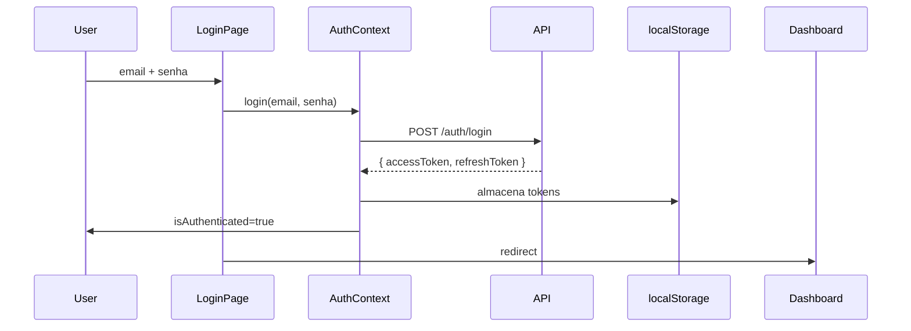
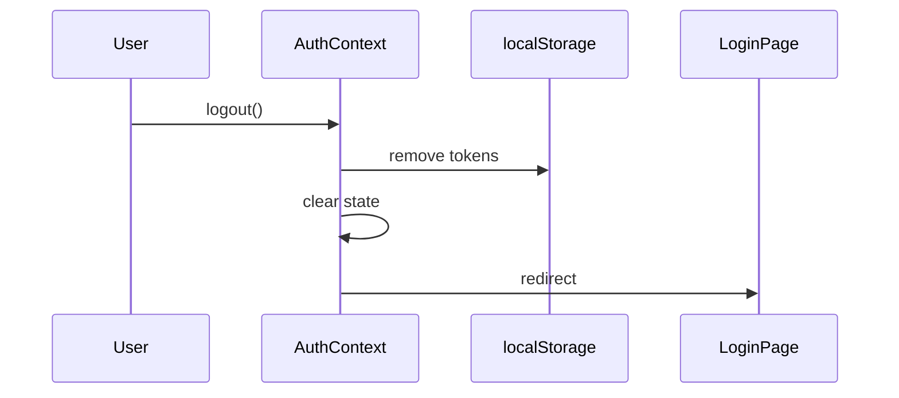

# Design - Autenticação Fronted (pedi-ai-app)

## Decisions Arquiteturais

### 1. Estado de Autenticação

Usar React Context API + localStorage para persistência.

```typescript
interface AuthState {
  user: User | null;
  accessToken: string | null;
  isAuthenticated: boolean;
  isLoading: boolean;
}
```

### 2. AuthContext

```
src/lib/auth-context.tsx (substitui auth.tsx atual)
```

Métodos:
- `login(email, senha)` → POST /auth/login → armazena tokens
- `logout()` → limpa tokens, redireciona para /login
- `refreshToken()` → POST /auth/refresh → atualiza access token
- `getAccessToken()` → retorna token atual

### 3. ProtectedRoute Component

```tsx
// src/components/auth/ProtectedRoute.tsx
<ProtectedRoute>
  <Dashboard />
</ProtectedRoute>
```

Redireciona para /login se não autenticado.

### 4. API Client Interceptor

Atualizar `src/lib/api.ts` para incluir Authorization header automaticamente.

```typescript
// Intercepta todas requisições
api.interceptors.request.use((config) => {
  const token = authContext.getAccessToken();
  if (token) {
    config.headers.Authorization = `Bearer ${token}`;
  }
  return config;
});

// Intercepta respostas para tratar 401
api.interceptors.response.use(
  (response) => response,
  async (error) => {
    if (error.response?.status === 401) {
      // Tenta refresh ou logout
    }
    return Promise.reject(error);
  }
);
```

### 5. Refresh Token Automático

Quando access token expira (recebe 401), tenta refresh automaticamente antes de mostrar erro.

```typescript
// Diagrama de fluxo
Requisição → 401 → tenta refresh → sucesso → retry requisição
                        ↓
                    falha → logout → redirect /login
```

## Estrutura de Arquivos

```
src/
├── app/login/page.tsx           (ATUALIZAR)
├── components/
│   └── auth/
│       └── ProtectedRoute.tsx  (NOVO)
└── lib/
    ├── api.ts                   (ATUALIZAR - interceptor)
    └── auth-context.tsx         (NOVO - substitui auth.tsx)
```

## Rotas Protegidas

| Rota | Protegida | Redirect |
|------|-----------|----------|
| / | Não | - |
| /login | Não | Se logado → /dashboard |
| /dashboard | Sim | /login |
| /pedidos | Sim | /login |
| /usuarios | Sim | /login |

## Login Flow



## Logout Flow



## Validação de Input

```typescript
// LoginPage validation
const errors = {
  email: !email || !isEmail(email) ? 'Email inválido' : undefined,
  senha: !senha || senha.length < 6 ? 'Senha deve ter pelo menos 6 caracteres' : undefined,
};
```

## Estados de Interface

- **Loading:** Spinner while authenticating
- **Error:** Red message below form with error
- **Success:** Redirect to /dashboard

## Implementação Passo a Passo

1. Criar `src/lib/auth-context.tsx` com AuthContext
2. Criar `src/components/auth/ProtectedRoute.tsx`
3. Atualizar `src/lib/api.ts` com interceptors
4. Atualizar `src/app/login/page.tsx` para usar AuthContext
5. Criar `src/app/(protected)/Dashboard.tsx` etc com ProtectedRoute
6. Adicionar useAuth hook export
7. Atualizar Sidebar para mostrar usuário logado
